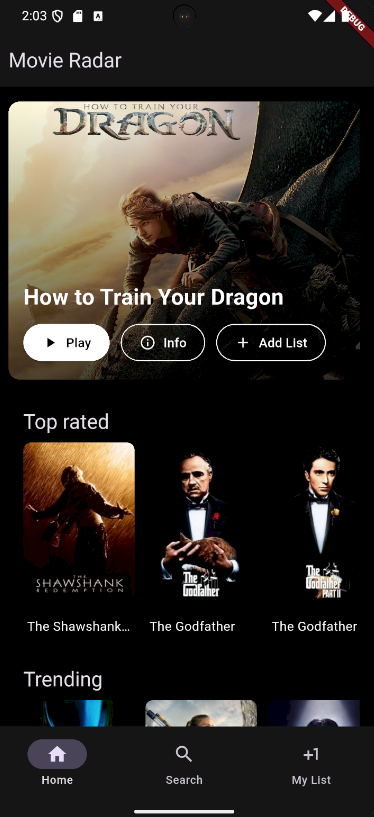
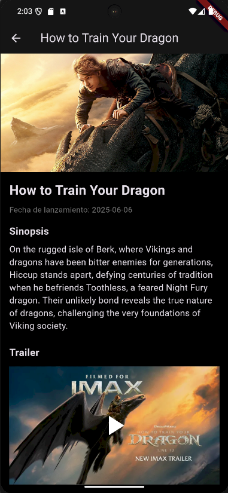
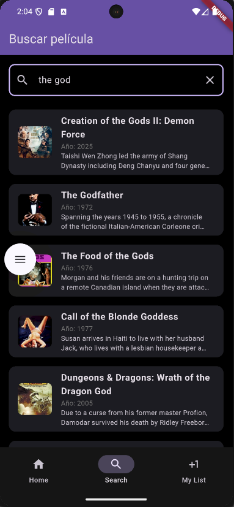
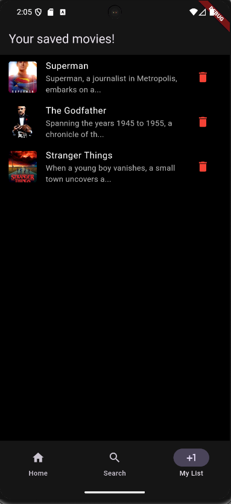

# MovieRadar 🎬

**MovieRadar** es una aplicación móvil desarrollada con **Flutter** para la búsqueda y exploración de películas.  
El proyecto está construido siguiendo **buenas prácticas de desarrollo**, con una **arquitectura de carpetas clara y escalable**, y hace uso de una **API externa** para obtener información detallada de las películas.

> 💡 El objetivo de este proyecto es servir como referencia educativa para otros desarrolladores que quieran aprender sobre Flutter, organización de proyectos y consumo de APIs en aplicaciones móviles.

## Cómo usar?

1. Clona este repositorio.  
2. Asegúrate de tener configurado Android Studio y un dispositivo/emulador.  
3. Crea una cuenta en [TMDB](https://www.themoviedb.org/) y genera una API Key.  
4. En el archivo `tmdb_config.dart`, reemplaza la constante de la API por la tuya.  
5. Ejecuta la aplicación y aprende! :).

---

## 📸 Screenshots

  

  

  

  

